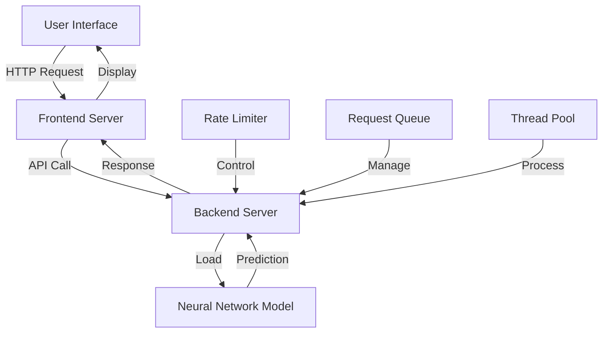
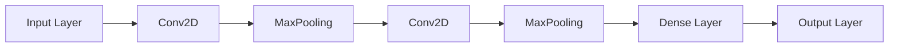

# Digit Classifier Deep Learning 🔢

[](https://github.com/Kedhareswer/Digit_Classifier_DeepLearning/stargazers)
[](https://opensource.org/licenses/MIT)
[](https://www.docker.com/)
[](https://heroku.com)

A modern web-based handwritten digit recognition application powered by Deep Learning. The system uses a custom neural network trained on the MNIST dataset to classify both single and multiple handwritten digits with high accuracy.

## 📑 Table of Contents

- [Features](#-features)
- [Architecture](#-architecture)
- [Tech Stack](#-tech-stack)
- [Getting Started](#-getting-started)
- [Usage Guide](#-usage-guide)
- [Deployment Options](#-deployment-options)
- [Model Details](#-model-details)
- [Contributing](#-contributing)
- [License](#-license)

## ✨ Features

| Category | Features |
|----------|----------|
| Recognition Capabilities | • Single digit recognition<br>• Multiple digit recognition<br>• Real-time predictions<br>• Confidence scores<br>• Alternative interpretations |
| User Interface | • Modern, responsive design<br>• Dark theme support<br>• Real-time drawing canvas<br>• Touch screen support<br>• Adjustable brush size |
| Performance & Security | • Request queuing system<br>• Concurrency control<br>• Rate limiting<br>• Automatic retry mechanism |
| Deployment | • Docker container support<br>• Heroku-ready configuration<br>• Environment-based setup<br>• Health monitoring |

## 🏗 Architecture



## 🛠 Tech Stack

| Layer | Technologies |
|-------|--------------|
| Frontend | • Next.js 15<br>• React<br>• TypeScript<br>• Shadcn UI<br>• Tailwind CSS |
| Backend | • FastAPI<br>• Python<br>• Asyncio |
| Machine Learning | • TensorFlow<br>• Keras<br>• OpenCV<br>• Pillow |
| DevOps | • Docker<br>• Docker Compose<br>• Heroku |

## 🚀 Getting Started

### Prerequisites

```table
| Requirement | Version |
|-------------|---------|
| Node.js     | ≥ 18.0  |
| Python      | ≥ 3.8   |
| Git         | Any     |
```

### Installation Steps

1. **Clone the Repository**
   ```bash
   git clone https://github.com/Kedhareswer/Digit_Classifier_DeepLearning.git
   cd Digit_Classifier_DeepLearning
   ```

2. **Frontend Setup**
   ```bash
   npm install
   ```

3. **Backend Setup**
   ```bash
   cd backend
   pip install -r requirements.txt
   ```

## 📱 Usage Guide

### Running in Development Mode

1. **Start Backend Server**
   ```bash
   cd backend
   python -m uvicorn app:app --reload
   ```

2. **Start Frontend Server**
   ```bash
   # In a new terminal
   npm run dev
   ```

3. Navigate to `http://localhost:3000`

### Using the Application

1. **Choose Recognition Mode**
   - Single Digit: For one digit at a time
   - Multiple Digits: For multiple digit recognition

2. **Draw Digits**
   - Use mouse or touch input
   - Adjust brush size if needed
   - Keep digits clear and centered

3. **View Results**
   - Predictions appear automatically
   - Check confidence scores
   - View alternative predictions
   - Use "Clear Canvas" to reset

## 🌐 Deployment Options

| Method | Description | Best For |
|--------|-------------|----------|
| Docker Compose | Single command deployment with `docker-compose up -d` | Production |
| Separate Containers | Independent scaling of frontend and backend | Custom setups |
| Manual Deployment | Traditional setup with direct package installation | Development |
| Heroku | Cloud deployment with automatic scaling | Quick cloud setup |

## 🧠 Model Details

### Neural Network Architecture



### Model Features
- Based on MNIST dataset
- Enhanced preprocessing pipeline
- Real-time inference
- Confidence scoring system
- Multiple digit support

## 🤝 Contributing

1. Fork the repository
2. Create feature branch (`git checkout -b feature/AmazingFeature`)
3. Commit changes (`git commit -m 'Add AmazingFeature'`)
4. Push to branch (`git push origin feature/AmazingFeature`)
5. Open a Pull Request

## 📄 License

This project is licensed under the MIT License - see the [LICENSE](LICENSE) file for details.

---

## 🙏 Acknowledgments

- TensorFlow and Keras teams
- FastAPI framework
- Next.js and React communities
- Shadcn UI components
