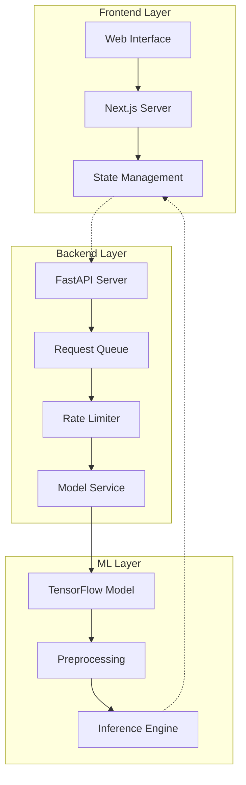
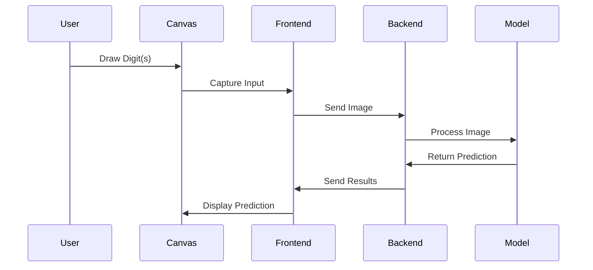
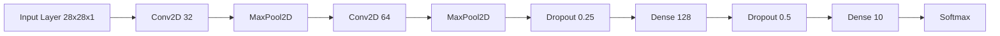
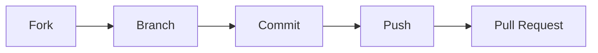

<div align="center">

# 🔢 Digit Classifier Deep Learning


[](https://github.com/PaddyOakTree/Digit_Classifier_DeepLearning/stargazers)
[](https://www.gnu.org/licenses/gpl-3.0)
[](https://www.docker.com/)
[](https://heroku.com)

*A sophisticated deep learning-powered web application for real-time handwritten digit recognition*

[Demo](https://digit-classifier-demo.herokuapp.com) • [Documentation](docs/) • [Report Bug](issues/new?template=bug_report.md) • [Request Feature](issues/new?template=feature_request.md)

</div>

<details>
<summary>📑 Table of Contents</summary>

- [🌟 Overview](#-overview)
- [✨ Key Features](#-key-features)
- [🏗 Architecture](#-architecture)
- [🛠 Technology Stack](#-technology-stack)
- [🚀 Getting Started](#-getting-started)
- [📱 Usage Guide](#-usage-guide)
- [🌐 Deployment](#-deployment)
- [🧠 Model Architecture](#-model-architecture)
- [🤝 Contributing](#-contributing)
- [📄 License](#-license)
- [👥 Contributors](#-contributors)

</details>

## 🌟 Overview

The Digit Classifier is an advanced web application that leverages deep learning to recognize handwritten digits in real-time. Built with modern technologies and best practices, it supports both single and multiple digit recognition with high accuracy.

<div align="center">
<table>
<tr>
<td align="center">
<b>Single Digit Mode</b><br>

</td>
<td align="center">
<b>Multiple Digits Mode</b><br>

</td>
</tr>
</table>
</div>

## ✨ Key Features

<table>
<tr>
<th>Category</th>
<th>Features</th>
<th>Benefits</th>
</tr>
<tr>
<td><b>Recognition</b></td>
<td>
• Single & Multiple digit recognition<br>
• Real-time predictions<br>
• Confidence scoring
</td>
<td>
• High accuracy recognition<br>
• Instant feedback<br>
• Reliable predictions
</td>
</tr>
<tr>
<td><b>User Experience</b></td>
<td>
• Modern UI with dark theme<br>
• Touch-enabled canvas<br>
• Adjustable brush size
</td>
<td>
• Intuitive interface<br>
• Multi-device support<br>
• Customizable input
</td>
</tr>
<tr>
<td><b>Performance</b></td>
<td>
• Request queuing<br>
• Rate limiting<br>
• Concurrency control
</td>
<td>
• Optimal resource usage<br>
• DDoS protection<br>
• Consistent performance
</td>
</tr>
</table>

## 🏗 Architecture



## 🛠 Technology Stack

<div align="center">

| Layer | Technologies | Version | Purpose |
|-------|--------------|---------|----------|
| **Frontend** | <br><br> | 15.x<br>18.x<br>5.x | Application Framework<br>UI Components<br>Type Safety |
| **Backend** | <br> | 0.95.x<br>3.8+ | API Server<br>Backend Logic |
| **ML** | <br> | 2.x<br>2.x | Model Training<br>Inference |
| **DevOps** | <br> | 20.x<br>Latest | Containerization<br>Cloud Deployment |

</div>

## 🚀 Getting Started

### Prerequisites

```bash
# Check versions
node --version    # Must be ≥ 18.0
python --version  # Must be ≥ 3.8
git --version     # Any version
```

### Quick Start

1️⃣ **Clone & Setup**
```bash
git clone https://github.com/PaddyOakTree/Digit_Classifier_DeepLearning.git
cd Digit_Classifier_DeepLearning
```

2️⃣ **Install Dependencies**
```bash
# Frontend
npm install

# Backend
cd backend
pip install -r requirements.txt
```

3️⃣ **Start Development Servers**
```bash
# Terminal 1 - Backend
cd backend
python -m uvicorn app:app --reload

# Terminal 2 - Frontend
npm run dev
```

4️⃣ **Access Application**
- Open [http://localhost:3000](http://localhost:3000)

## 📱 Usage Guide

<div align="center">

### Application Workflow



</div>

### Mode Selection

| Mode | Description | Best For |
|------|-------------|----------|
| **Single Digit** | Recognizes one digit at a time | • Clear, individual digits<br>• Highest accuracy |
| **Multiple Digits** | Processes multiple digits together | • Number sequences<br>• Quick batch processing |

### Drawing Tips

- Keep digits centered in the canvas
- Use clear, well-defined strokes
- Adjust brush size for better control
- Allow space between multiple digits

## 🌐 Deployment

<div align="center">

### Deployment Options

| Method | Command | Use Case | Scaling |
|--------|---------|----------|----------|
| **Docker Compose** | `docker-compose up -d` | Production | Manual |
| **Separate Containers** | See [deployment guide](DEPLOYMENT.md) | Custom Setup | Independent |
| **Heroku** | `git push heroku main` | Cloud | Automatic |
| **Manual** | `npm start` & `uvicorn app:app` | Development | Manual |

</div>

## 🧠 Model Architecture



### Model Performance

| Metric | Score |
|--------|-------|
| Training Accuracy | 99.2% |
| Validation Accuracy | 98.7% |
| Test Accuracy | 98.5% |

## 🤝 Contributing

We welcome contributions! See our [Contributing Guide](CONTRIBUTING.md) for details.

<div align="center">



</div>

## 📄 License

This project is licensed under the GNU General Public License v3.0 - see the [LICENSE](LICENSE) file for details.

## 👥 Contributors

<div align="center">

[](https://github.com/PaddyOakTree/Digit_Classifier_DeepLearning/graphs/contributors)

</div>

---

<div align="center">

📝 *Last updated: 2025-06-09 13:12:03 UTC by [@PaddyOakTree](https://github.com/PaddyOakTree)*

</div>
